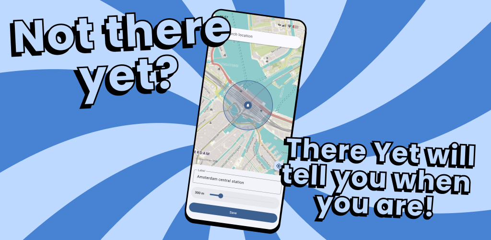

#  There Yet - Location Alarm

**Not there yet? There Yet will tell you when you are.**

Place a pin on the map, set a radius, and get alerted when you arrive. No accounts, no tracking, no Google Play Services.

<!--[](https://f-droid.org/packages/nl.bw20.there_yet)-->
<!--[](https://play.google.com/store/apps/details?id=nl.bw20.there_yet)-->
[](https://liberapay.com/BW20)



## Features

- **Proximity alarms** — set a location and radius, get alerted when you arrive
- **Background monitoring** — keeps working when the app is closed or the screen is off
- **Offline-capable** — map tiles are cached locally after first viewing
- **Location search** — find places by name with autocomplete
- **Material You** — dynamic colors, dark mode, supports 14 languages

## Privacy

There Yet is designed to keep your data on your device. See [PRIVACY.md](PRIVACY.md) for full details.

- All alarm data stays on-device (SQLite)
- No accounts, no analytics, no telemetry, no ads
- No Google Play Services required
- Works on privacy-focused ROMs (GrapheneOS, CalyxOS, LineageOS)

**Network calls (only when using the map):**
- Map tiles from OSM France (`tile.openstreetmap.fr`)
- Search and reverse geocoding via Photon (`photon.komoot.io`)

## Building from source

Requires [Nix](https://nixos.org/) with flakes enabled:

```sh
nix develop          # enter dev shell
flutter pub get      # fetch dependencies
flutter run          # run in debug mode
mask check           # format, analyze, and test
```

## Tech stack

- Flutter + Riverpod
- Drift (SQLite) for persistence
- flutter_map with OpenStreetMap tiles
- Photon geocoding by Komoot
- Kotlin native layer for alarm service, notifications, and proximity alerts

## License

[EUPL 1.2](LICENSE) — open source, copyleft.

Map data: [OpenStreetMap contributors](https://www.openstreetmap.org/copyright) (ODbL).
Geocoding: [Photon](https://photon.komoot.io/) by Komoot.
